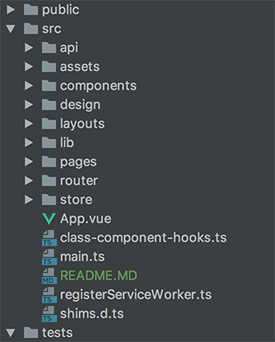

## Vue 2 Best Practices
VueJS and Javascript give developers a large amount of freedom to architect applications as they see fit, which is both a blessing and a curse.
When creating front-end applications a developer may commit mistakes or take shortcuts which at first may seem like a good idea but ultimately
fall prey to common and painful issues.

With this guide we hope to:
* Eliminate the cause of many common problems.
* Produce code that easily and sanely scales over the long run.
* Reduce the productivity cost of maintaining and designing new features.
* Answer common questions for those that are new to front-end/VueJS development.
* Reduce the amount of decisions a developer must make before typing any code. 
* Create code that can easily and effectively be unit tested.

**Note: this guide is complementary to the [Vue 2 Style Guide](https://vuejs.org/v2/style-guide/).**

## Directory Structure
This suggested directory structure is meant to help developers quickly locate logic and assets they wish to modify or debug.
You may find that this structure doesn't make sense for your use case and change accordingly. However, you should 
**always** be consistent within your project.
 

| Directory  | Description |
| ------------- | ------------- |
| src/api |  All `endpoints`, `models` and `interceptors` for communicating with the API should be housed within this folder.|
| src/assets  |Static assets (images mostly) |
| src/components | **Sharable and Base** components only. This folder should only house components that can be used more than once.
| src/design | "Any values that need to be accessible from JavaScript outside of a Vue component can be defined here, prefixed with `global-` to avoid conflicts with classes." |
| src/layouts | An application may contain multiple layout styles (ex: the login page only has the center div (no nav bar, etc) while the other pages have nav bars, title bars, full screen content.. etc).|
| src/pages | This is where you house components that represent an entire page. Routes should *only* be referencing these components. |
| src/router | Contains all routes in the site.|
| src/router/guards | Contains all route guards.|
| src/store | The main vuex store + submodules are contained here.|

## Components
Having clear set definitions of component types and an easy understanding of their functionality significantly lowers
the cognitive cost of debugging and speeds up the creation of new functionality, providing a huge productivity boost. 

The suggested structure of components makes it simple to split work amongst developers. If developers focus on a particular
component type, other developers can agree on a contract of functionality between them. Having unclear expectations can easily 
cause misunderstandings, duplicate logic and bugs. 

Ideally, there should be at least three types of components: **"Base", "Page" and "Shared"**.

### Page Components

Page components should be completely aware of the application context. These components are (as the name implies) the representation of each "page" within the application. All routes should use Page components. A Page component may be composed of its own logic/html, Shared components and Base components.

* It's **highly** encouraged that Page components handle all API communications (through vuex). Communication with Shared components should use custom events in the Shared component ("onSave", "onUpdate", etc). There are a lot of reasons to do this:
  * Shared components are never guaranteed to be used only once per page, this could cause duplicate/wasteful API calls.
  * It's easier to optimize API calls in the Page component- you can for example cache results or get an entire list at once.
   * You can always still make the requests separately and display the Shared components as their data become available. You have all the choices.
  * It defeats the point of shared components by tightly coupling their functionality with your application's vuex store.
  * It will be difficult to track down bugs when calls are made in many places. It's likely that you'll only have page loaded at a time- making it much easier to know where to start debugging.
 * It's unlikely that Page components will grow much larger because of this as most of the API logic will still be handled by Vuex, API models and the fact that Pages can be mostly composed of other components.
* Examples of Page components:
  * A `cart-items-page`. A cart could display a list of items (shared component). A list of items is loaded through Vuex and the results sorted/filtered (whatever else) and passed down to shared components.

### Base Components
Base components are meant to be reusable by all other components (including other base components). These components should be limited to very specific functionality and it should be possible to use the component outside a single specific application. Avoid doing too much of ANYTHING within a single base component.

* Examples of base components:
  * Instead of "FeaturesTable" make a "BaseTable" component and receive the desired headers and content from the Page component.
* All base components should be given a name prefixed with `Base`.
  * Example: `BasePrimaryButton`, `BaseDropdown`, `BaseSwitch`.
* This does not mean you can't use ui libraries (like bootstrap) in these components.

### Shared Components
Shared components are essentially an extension of Base components but context aware in order to build larger pieces of functionality. These components must be reusable across Page components and should still be as focused as possible. To avoid needing intimate knowledge of children components, usage of scoped slots is encouraged.

* Example of a Shared components:
  * Say you have two Page components: `create-member-page` and `edit-member-page`. These two pages contain the same shared component `member-editor` which lists all available fields to be edited with pre-existing values if the member already exists. Since the two pages share a lot in common, our shared component saves us a lot of duplication. 
  * Each Page component sends a list of fields to that can be edited and validation depends on that list. The shared component must know the fields list so that it can enable/disable the specific inputs in the HTML file and handle different validation making the component context aware (it edits a member).
  * If you're wondering why we wouldn't perform the validation at the "Page" component - 
  having the validation happen at the Page components would cause duplicate logic between the two pages.
  * **However** do note that this component doesn't care about what "edit" and "create" means- it's possible that a new Page component called `view-member-page` configures the fields so that they're ALL disabled. This is a great example of allowing re-usability and focusing on specific functionality allowing different Page components to determine usage.
